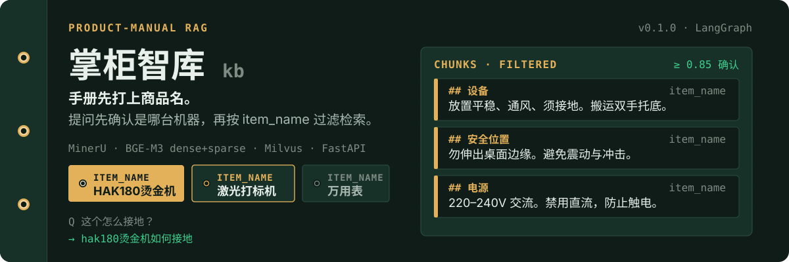
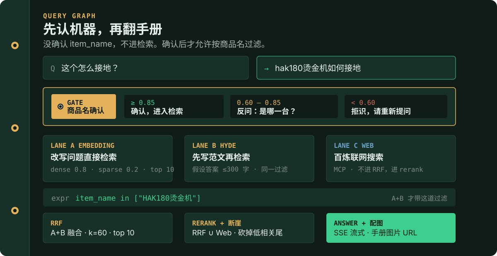
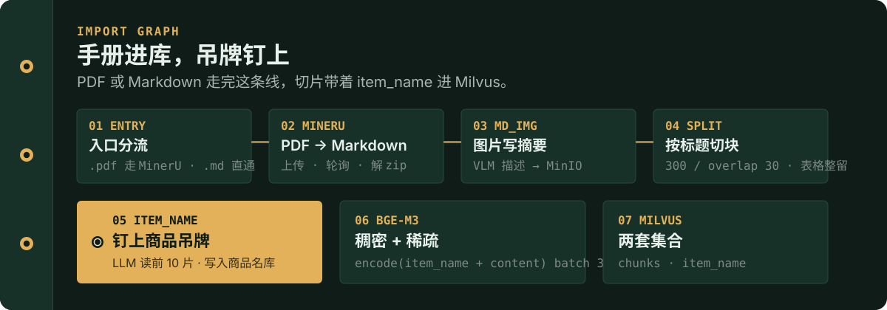

<p align="center">
  
</p>

设备手册不能混着搜。烫金机的接地说明和万用表的接地说明不是同一件事。

这套仓库把每份手册打上 `item_name`，提问时先确认是哪台机器。分数够了才允许按商品名过滤，做混合检索并作答；不够就反问或拒识。

- **导入**：PDF / Markdown → 切片 → 钉上商品吊牌 → BGE-M3 稠密 + 稀疏 → Milvus
- **查询**：确认商品名 → 向量 / HyDE / 联网 三路召回 → RRF → rerank 断崖 → 流式答案 + 手册配图
- **界面**：`import.html` 上传，`chat.html` 问答（页面标题就是「掌柜智库」）

<p align="center">
  
</p>

## 为什么先认机器

普通 RAG 用问题去打全部切片。这里多一道闸：

1. 从当前问题和最近 10 轮历史里抽出商品名，并改写成独立问题。
2. 用 BGE-M3 去 **商品名集合** 做稠密 0.8 / 稀疏 0.2 的混合检索。
3. 按分数分流（`node_item_name_confirm.py`）：

| 分数 | 行为 |
|---|---|
| ≥ 0.85 | 确认，带着 `item_name in [...]` 进入检索 |
| 0.60 – 0.85 | 反问「请确认你要咨询的商品是这些的哪一个？」 |
| &lt; 0.60 或抽不出名字 | 拒识，请重新提问 |

确认之后，本地两路检索都带同一条过滤。联网搜索不进 RRF，在 rerank 阶段才和本地结果合并。

工作示例写在代码里：`hak180产品安全手册.pdf` → 商品名类似 `HAK180烫金机` / `BrotherHAK180烫金机`。用户说「这个怎么接地？」，改写成「hak180烫金机如何接地」。

## 手册怎么进库

<p align="center">
  
</p>

关键节点都在 `kb/atguigu/import_process/nodes/`：

| 节点 | 做什么 |
|---|---|
| `node_entry` | 看后缀：`.pdf` 走 MinerU，`.md` 跳过转换 |
| `node_pdf_to_md` | 上传 MinerU，轮询 zip，解开 Markdown |
| `node_md_img` | 抽 ``，视觉模型写摘要，图片进 MinIO |
| `node_document_split` | 按 ATX 标题切章，再 300 / 30 切块；`<table` 整段保留 |
| `node_item_name_recognition` | 读前 10 片 + 文件名，LLM 识别主体，写入商品名集合 |
| `node_bge_embedding` | `item_name + content`，BGE-M3 一次出稠密和稀疏，batch=3 |
| `node_import_milvus` | 写入切片集合（带 `item_name` 标量字段） |

向量检索时用的表达式就是导入时打上的字段：

```text
item_name in ["HAK180烫金机"]
```

## 仓库里有什么

```text
kb/
  pyproject.toml          # 包名 kb，Python ≥ 3.12，uv + CUDA 128 的 torch 源
  atguigu/
    import_process/       # 导入图
    query_process/        # 查询图
    tool/                 # Milvus / MinIO / Mongo / BGE-M3 / rerank / MCP
    web/api/              # FastAPI：导入 :8000，查询 :8001
    web/page/             # import.html · chat.html
    config/               # 从 kb/.env 读配置
```

两套 Milvus 集合：切片库（问答用）和商品名库（确认用）。对话历史在 Mongo。图片在 MinIO。答案走 SSE：`delta` 推字，`final` 带 `image_urls`。

## 怎么跑

工程在 `kb/`，不是仓库根目录。配置文件是 `kb/.env`（`atguigu/config/config.py` 从那里加载）。

```bash
cd kb
uv sync

# 准备 kb/.env，至少要能连上 LLM、Milvus、Mongo、MinIO、MinerU、BGE-M3、rerank、DashScope MCP
export PYTHONPATH=.

python atguigu/web/api/import_service.py   # http://127.0.0.1:8000
python atguigu/web/api/query_service.py    # http://127.0.0.1:8001
```

用浏览器打开：

- [`kb/atguigu/web/page/import.html`](kb/atguigu/web/page/import.html) — 上传 PDF / Markdown，轮询 `/status/{task_id}`
- [`kb/atguigu/web/page/chat.html`](kb/atguigu/web/page/chat.html) — 提问，走 `/query` + `/stream/{task_id}`

两个 HTML 把 API 写死在 `127.0.0.1:8000` / `:8001`。BGE-M3 可用 `atguigu/tool/download_bgem3.py` 从 ModelScope 拉 `BAAI/bge-m3`（脚本里的缓存路径是本机 Windows 路径，按环境改）。

`.env` 里会出现的键（没有默认值，空着会在运行时炸掉）：

| 用途 | 变量 |
|---|---|
| LLM / 视觉 / 商品名模型 | `OPENAI_API_KEY` `OPENAI_API_BASE` `MODEL_PROVIDER` `ITEM_MODEL` `VL_MODEL` `LLM_DEFAULT_TEMPERATURE` |
| MinerU | `MINERU_TOKEN` `MINERU_BASE_URL` |
| 向量 | `BGE_M3_PATH` `BGE_DEVICE` `BGE_FP16` `MILVUS_URL` `CHUNKS_COLLECTION` `ITEM_NAME_COLLECTION` |
| 存储 | `MONGO_URL` `MONGO_DB_NAME` `MINIO_ENDPOINT` `MINIO_ACCESS_KEY` `MINIO_SECRET_KEY` `MINIO_BUCKET_NAME` `MINIO_IMG_DIR` |
| 联网 / 重排 | `MCP_DASHSCOPE_BASE_URL` `RERANK_BASE_URL` |

## 接口

导入服务 `:8000`

| 方法 | 路径 | 作用 |
|---|---|---|
| `POST` | `/upload` | 存本地、备份 MinIO、后台跑导入图，返回 `task_id` |
| `GET` | `/status/{task_id}` | 任务进度 |

查询服务 `:8001`

| 方法 | 路径 | 作用 |
|---|---|---|
| `GET` | `/health` | 探活 |
| `POST` | `/query` | `{ query, session_id }`，后台跑查询图 |
| `GET` | `/stream/{task_id}` | SSE：`progress` / `delta` / `final` / `error` |
| `GET` | `/history/{session_id}` | 最近对话 |
| `DELETE` | `/history/{session_id}` | 清空对话 |

## 现在还不能当生产用

这些是代码里的真实约束，不是路线图：

- **课程作业形态。** 包路径叫 `atguigu`，注释和测试入口指向尚硅谷「智库掌柜」课堂资料。
- **Windows 路径写死。** 导入接口把文件落到 `D:\output\{日期}\`；若干 `__main__` 和 BGE 下载脚本使用 `I:\...`。换机器要改。
- **依赖一整套外部服务。** 没有 Milvus / Mongo / MinIO / MinerU / 本地 BGE-M3 / rerank / DashScope MCP / LLM，图跑不起来。仓库不带这些服务的 docker-compose。
- **CORS 全开**（`allow_origins=["*"]`），两个 HTML 页面也没有鉴权。
- **没有测试套件。** 节点文件底部的 `if __name__ == "__main__"` 是手工调试，不是 CI。
- **RRF 只融合本地两路。** 网页结果在 `node_rerank` 才并进来；rerank 之后用相对 0.25 / 绝对 0.10 做断崖，最少留 3 条、最多 10 条。
- **Prompt 截断到 10000 字符。** 答案要求图片 URL 必须来自本地切片，不编造。

## 许可

仓库未放 LICENSE 文件。
